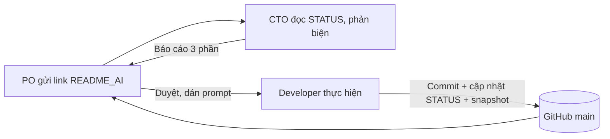

# WORKFLOW — Ai làm gì, làm theo vòng nào

## 1. Vòng làm việc

1 vòng = 1 việc nhỏ, kiểm tra được. PO là người duy nhất chuyển prompt giữa các AI.

## 2. Vai trò
| Vai | Ai | Được làm | Không được làm |
|---|---|---|---|
| PO | Con người | Chốt mục tiêu, trả lời câu hỏi Q#, duyệt kết quả | — |
| CTO | ChatGPT / Gemini / AI PO chỉ định | Đọc tài liệu, phản biện, báo cáo, viết prompt | Sửa code; đề xuất việc ngoài STATUS khi chưa báo PO |
| Dev A | **Antigravity** (Gemini) | Code + kiểm tra trên trình duyệt | Đổi schema DB, auth, API mà không có prompt chỉ định |
| Dev B | **Claude Code** (Claude) | Code + chạy lệnh + review + cập nhật tài liệu | Đổi layout/CSS khi việc không yêu cầu |

## 3. Phân việc theo thế mạnh
| Loại việc | Giao cho | Lý do |
|---|---|---|
| Giao diện, CSS/Tailwind, responsive, so sánh ảnh chụp | Antigravity | Có trình duyệt tích hợp, mạnh về đa phương thức (nhìn ảnh) |
| Quét nhanh nhiều file, sửa chữ/chính tả hàng loạt | Antigravity (Flash) | Nhanh, rẻ |
| Backend, API, SQLite, auth, bảo mật, tính giá | Claude Code | Mạnh về suy luận nhiều bước, sửa đa file an toàn |
| Refactor, review code, tìm lỗi, viết test | Claude Code | Đọc hiểu code sâu, có `/code-review` |
| Cập nhật STATUS/snapshot/DECISIONS | Developer vừa làm việc đó | Người làm biết rõ nhất |
| Kế hoạch phase mới, kiến trúc lớn | Claude Code (Opus/Fable) → CTO phản biện | Cần suy luận dài |

## 4. Chọn model (rẻ nhất mà đủ dùng)
| Mức việc | Antigravity | Claude Code |
|---|---|---|
| Nhỏ: sửa chữ, 1 file, cập nhật tài liệu | Gemini 3.6 Flash | Haiku 4.5 |
| Vừa: tính năng thường, 2–5 file | Gemini 3.1 Pro | Sonnet 5 |
| Khó: nhiều module, bảo mật, lỗi khó | Gemini 3.5 Pro | Opus 5.5 |
| Rất khó: lên kế hoạch phase, audit toàn dự án | — | Fable 5 |
Quy tắc: bắt đầu từ mức thấp; chỉ nâng model khi thất bại 1 lần hoặc CTO ghi rõ lý do.

## 5. Nhánh & bàn giao
- Việc nhỏ: commit thẳng `main`. Việc vừa/khó: nhánh `snap-XXX-<ten-viec>` → PR → PO merge.
- Hai Developer chạy song song chỉ khi prompt ghi rõ danh sách file của mỗi bên không trùng nhau.

## 6. Mở rộng khi dự án lớn
- Thêm module mới → thêm `docs/ai/modules/<ten>.md` + 1 dòng trong CODEMAP.
- Thêm phase mới → `docs/plans/PHASE_<n>_<ten>.md`, STATUS trỏ tới.
- Thêm thành viên/AI → thêm 1 dòng ở §2 và §4. Không sửa cấu trúc các file khác.
